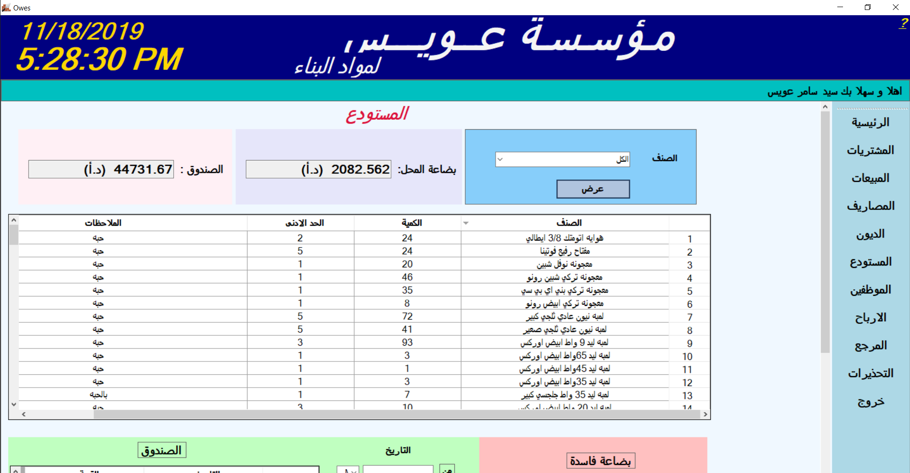

# Local Store Managing

## Overview
***Windows Based Application*** designed for a Home Improvement Material Store. This program was built in **"Arabic language"** based on user requirements.\
The program’s main objective is to manage the store’s inventory and the business financial performance allowing the store to be mainly paperless. The program is being used to manage inventory by registering customers and wholesalers’ transactions as well as inputting, editing, viewing, and searching receipts, and implementing notifications when the store is ready to reorder materials.\
To manage the financial performance of the store, the program has an accounting and managerial side to manage employees’ salaries, accounts payables, accounts receivables, expenses, sales, and profits. This program is user-friendly to view, search, and manage the entire store within a few clicks.

## Getting Started
These instructions will get you a copy of the project up and running on your local machine for development and testing purposes. They will also give an overview of some of the app's functionality.

### Prerequisites
You will need Microsoft Visual studio installed if you want to run this application locally. For help installing Microsoft Visual studio, please [click here](https://visualstudio.microsoft.com/thank-you-downloading-visual-studio/?sku=community&rel=16).

### Installing
Git clone the repository to your local machine:

HTTPS:
```
https://github.com/AmjedAyoub/LocalStoreManaging.git
```
SSH:
```
git@github.com:AmjedAyoub/LocalStoreManaging.git
```
In the cloned repository, navigate to **"BALOOTA"** folder, and open the ```"MyStore.sln"``` file in your visual studio.

You will then be able to start the app locally by running:

```
Ctrl + F5
```

## ScreenShots
### Sign in page

### Main/Sales page

### Purchase invoices entry page

### Purchase invoices edit page

### Purchase invoices show page

### Sale invoices edit page

### Sale invoices show page

### Expenses entry page

### Employees expenses edit page

### Store expenses edit page

### Expenses show page

### Purchases debt page

### sales debt page

### Employees Add/Edit debt page

### Employees pay debt page

### Store Add/Edit debt page

### Store pay debt page

### Inventory page

### Add employee page

### Edit employee page

### Employees salary page

### Employees password/username edit page

### Profit show page

### Events record page

### Alerts page


## Technologies & Tools
* C# programming language  
* MYSQL - MySQL Database
* Microsoft Visual Studio 2017

## Links
This program is published on [GitHub](https://github.com/AmjedAyoub/LocalStoreManaging).

## Planned updates
At the moment, this app is the minimum viable product. We hope to make updates to improve the UI/UX, and add more functionality and features such as the ability of managing the data from several stores if exists.
